Create data files for Maxent and Zonation analyses
========================================================

This script takes the downloaded data from the [Australian Living Atlas](http://www.ala.org.au/species-by-location/) and [NSW Atlas](http://www.environment.nsw.gov.au/atlaspublicapp/UI_Modules/ATLAS_/AtlasSearch.aspx) for all specified species with more than the specified minimum number of records, as well as the data from the brut dataset, and produces:   
1. a pdf of maps of all species locations (if `save.maps == TRUE`)   
2. a csv file of location points for input into Maxent `maxent.data`   
3. a spp file for input into Zonation that lists all of the species ascii files and other attributes `zonation.spp`  

The first part of the script takes the brut dataset where species have been coded into taxonomic groups and extracts data for species that have more than the specified minimum number of records that fall within the Hunter-Central Rivers CMA as masked by a shapefile. This is the same regio that data have been downloaded from the two atlases. 
*Note that the CMA doesn't overlap with the lower region of the HCCREMS region which may cause some predictive issues - need to consider how to deal with this.  We also end up with species that don't have any records with the HCCREMS area which may also be an issue.* 

Then we run a loop that runs through the listed species with more than the minumim number of records and extracts the latitude and longitude of all records in the ALA and NSW databases.  It assumes that there will always be records available from the ALA and will give a warning if there is no NSW atlas data. 
*Could either set species that don't occur in HCCREMS to negative values, so that they don't get selected or write some more complicated script that filters them out*


```r
# load packages and set working directory
rm(list = ls())

packages(ggplot2)
packages(ggmap)
packages(maptools)
packages(sp)

setwd("C:/Users/awhitehead/Documents/GIS data/Hunter/species point data/")

# save the maps as a pdf
save.maps <- FALSE
save.output <- TRUE

# set the google map background for the species plots and create
# background map
map <- get_map(location = c(151.25, -32.49), zoom = 7, maptype = "hybrid", color = "bw")
hunter.mask <- readShapePoly("C:/Users/awhitehead/Documents/GIS data/Hunter/data from Brendan/data/variables/projected GDA94/poly_lower_hunter.shp")
cma.mask <- readShapePoly("C:/Users/awhitehead/Documents/GIS data/Hunter/Plans/HCR_CMA/HCR_CMA_GDA94.shp")
hunter.mask.data <- fortify(hunter.mask)
cma.mask.data <- fortify(cma.mask)
print(base.map <- ggmap(map) + geom_polygon(aes(x = long, y = lat, group = group), 
    data = hunter.mask.data, colour = "yellow", fill = "black", alpha = 0.1, 
    size = 0.3) + geom_polygon(aes(x = long, y = lat, group = group), data = cma.mask.data, 
    colour = "light blue", fill = "black", alpha = 0.1, size = 0.3))
```

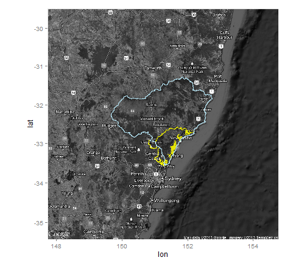 

```r

# The minimum number of records required for a species to be included
min.records <- 30

# open species list
threatened.species <- read.csv("C:/Users/awhitehead/Documents/GIS data/Hunter/species point data/Nationally listed threatened species.csv")

# identify which species have more than the minimum number of records
# across both atlases
species.list <- threatened.species$Scientific.Name[rowSums(threatened.species[, 
    c(2, 4)], na.rm = TRUE) > min.records]
species.list <- species.list[!is.na(species.list) == TRUE]

# create empty dataframes for the output data
maxent.data <- d(species = NULL, longitude = NULL, latitude = NULL)
atlas.zonation.spp <- d(weight = rep(1, length(species.list)), alpha = 1, bqp.row = 1, 
    bqp.buffer = 1, cell.removal = 1, species = NA)
missing.NSW.sp <- NULL

# open the brut dataset and generate spatial co-ordinates
modeled.sp <- read.csv("C:/Users/awhitehead/Documents/GIS data/Australia-wide/species data/modeledsp_order_brut.csv")
coordinates(modeled.sp) <- c("Lon_Centre", "Lat_Centre")

# clip the brut data by the CMA mask, provided there are at least 30
# points in the HCCREMS
cma.sp <- modeled.sp[cma.mask, ]
hunter.sp <- modeled.sp[hunter.mask, ]

# identify how many observations for each species within the hunter
n.obs <- d(obs = tapply(hunter.sp$SEL, hunter.sp$TAXON_ID, sum))
n.obs$taxa <- rownames(n.obs)
n.species <- length(which(n.obs$obs > min.records))
brut.zonation.spp <- d(weight = rep(1, nrow(n.obs)), alpha = 1, bqp.row = 1, 
    bqp.buffer = 1, cell.removal = 1, species = NA)

# set specifications for pdf file if save.maps == TRUE
if (save.maps == TRUE) pdf("species point data maps.pdf", paper = "a4r")

# extract each species with more than the minimum number of records from
# brut dataset
for (i in seq(n.obs$taxa)) {
    input <- as.data.frame(cma.sp[cma.sp$TAXON_ID == n.obs$taxa[i], ])
    colnames(input)[3:4] <- c("latitude", "longitude")
    input$species <- paste(input$Ordertot, input$TAXON_ID)
    
    if (nrow(input) > min.records) {
        maxent.data <- rbind(maxent.data, input[, c("species", "longitude", 
            "latitude")])
        print(sp.map <- base.map + geom_point(aes(x = longitude, y = latitude, 
            color = species), data = input, alpha = 0.5))
        brut.zonation.spp$species[i] <- glue(unique(input$species), ".asc")
    }
}
```

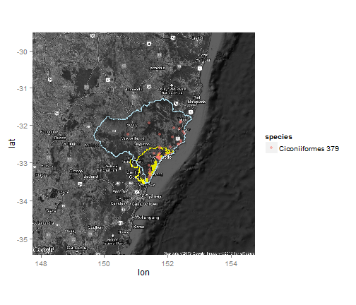 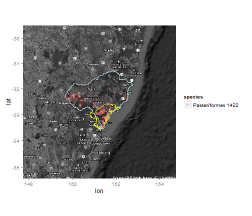 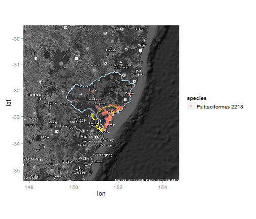 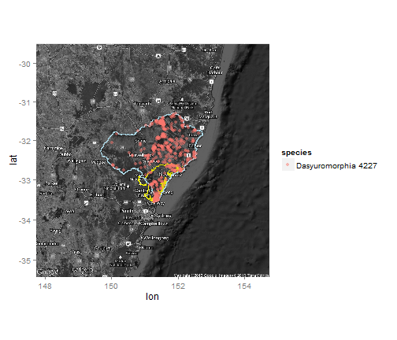 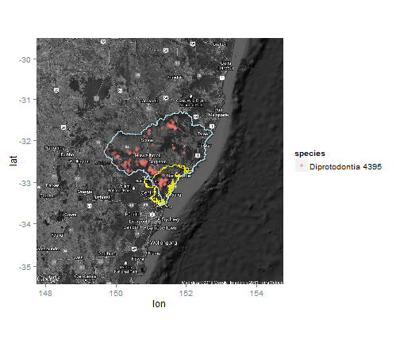 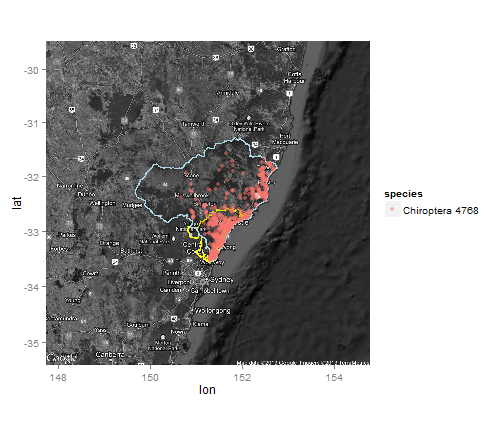 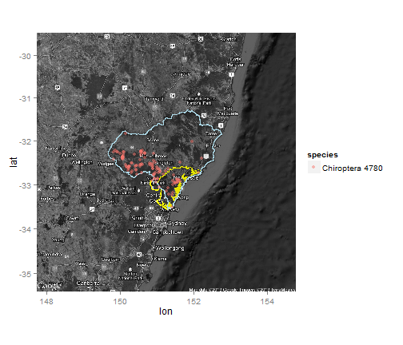 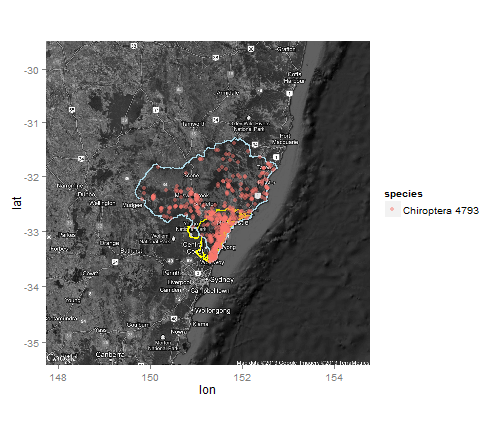    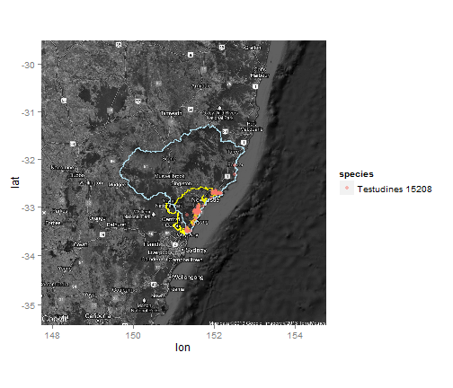  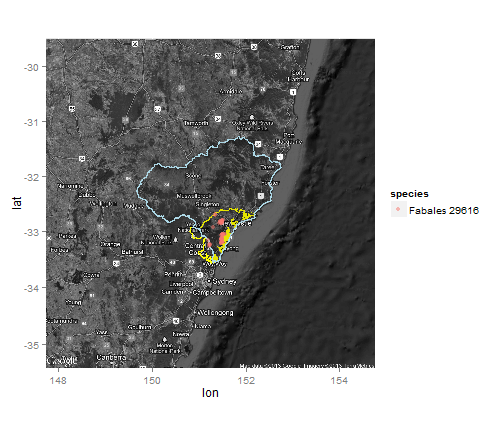       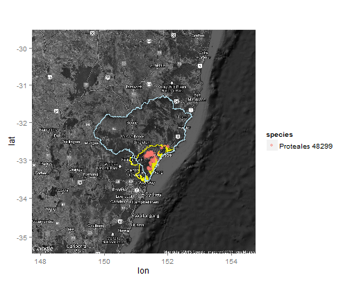 

```r

# create the zonation.spp file for the brut dataset
brut.zonation.spp <- brut.zonation.spp[!is.na(brut.zonation.spp$species), ]

# run loop to extract data from ALA and NSW atlas data by species
for (i in seq(species.list)) {
    # extract ALA data
    if (threatened.species$Downloaded.ALA[threatened.species$Scientific.Name == 
        species.list[i]] == "yes") {
        ALA.data <- read.csv(glue("ALA data/", species.list[i], ".csv"))
        colnames(ALA.data)[c(20:21)] <- c("latitude", "longitude")
        ALA.data$index <- paste(sprintf("%.6f", ALA.data$latitude), sprintf("%.6f", 
            ALA.data$longitude))
        ALA.data$database <- "ALA"
        ALA.data$species <- species.list[i]
    }
    
    # extract NSW Atlas data
    if (threatened.species$Downloaded.NSW.Atlas[threatened.species$Scientific.Name == 
        species.list[i]] == "yes") {
        NSW.data <- read.table(glue("NSW Atlas data/", species.list[i], ".txt"), 
            sep = "\t", header = TRUE, skip = 4)
        colnames(NSW.data)[c(21:22)] <- c("latitude", "longitude")
        NSW.data$index <- paste(sprintf("%.6f", NSW.data$latitude), sprintf("%.6f", 
            NSW.data$longitude))
        NSW.data$database <- "NSW"
        NSW.data$species <- species.list[i]
    }
    
    ALA.NSW.data <- tryCatch({
        rbind(ALA.data[, c("species", "longitude", "latitude", "database")], 
            NSW.data[, c("species", "longitude", "latitude", "database")])
    }, error = function(err) {
        if (threatened.species$Downloaded.NSW.Atlas[threatened.species$Scientific.Name == 
            species.list[i]] != "no") {
            print(paste0("No NSW data for species ", i, " (", species.list[i], 
                "): check to see if available for download"))
            append(missing.NSW.sp, species.list[i])
        }
        return(ALA.data)
    })
    
    # only include species if more than the minimum number of records occur in
    # the HCCREMS area ALA.NSW.points <-
    # SpatialPoints(ALA.NSW.data[,c('longitude','latitude')])
    coordinates(ALA.NSW.data) <- c("longitude", "latitude")
    in.hunter <- nrow(d(ALA.NSW.data[complete.cases(over(ALA.NSW.data, hunter.mask)), 
        ]))
    
    # produce maps of the distribution of each species
    if (in.hunter > min.records) {
        print(sp.map <- base.map + geom_point(aes(x = longitude, y = latitude, 
            color = database, shape = species), data = ALA.NSW.data, alpha = 0.5))
        
        # output data for maxent analyses
        maxent.data <- rbind(maxent.data, ALA.NSW.data[, c("species", "longitude", 
            "latitude")])
        
        # create file for zonation analyses
        atlas.zonation.spp$species[i] <- glue(species.list[i], ".asc")
    }
    
    # remove all species-specific datafiles, so they don't mess up the next
    # round of the loop
    suppressWarnings(rm(ALA.data, NSW.data, ALA.NSW.data, ALA.NSW.points, in.hunter))
    
}
```

```
Error: ggplot2 doesn't know how to deal with data of class
SpatialPointsDataFrame
```

```r

zonation.spp <- rbind(brut.zonation.spp, atlas.zonation.spp)

# close pdf file
if (save.maps == TRUE) dev.off()

# print sample map for RMarkdown
print(sp.map)
```

 

These are combined together in `maxent.data` where there are 3275 records for 69 species.  Note that there may be duplicate records in these files but they should be filtered out by Maxent. Maps of the distribution of each species are output into a pdf file (*C:/Users/awhitehead/Documents/GIS data/Hunter/species point data/species point data maps.pdf*)


```r
h(maxent.data)
```

```
##             species longitude latitude
## 1 Ciconiiformes 379     150.8   -32.26
## 2 Ciconiiformes 379     151.4   -33.41
## 3 Ciconiiformes 379     151.4   -33.09
## 4 Ciconiiformes 379     151.4   -31.95
## 5 Ciconiiformes 379     151.4   -33.26
## 6 Ciconiiformes 379     151.4   -33.37
```

```r

if (save.output == TRUE) write.csv(maxent.data, "C:/Users/awhitehead/Documents/GIS data/Hunter/species point data/maxent data/maxent.data.csv", 
    row.names = FALSE)
```

The `zonation.spp` table lists each species and the required input for zonation.  These are currently all set to `1` and will require some tinkering as we get further down the line. This assumes that we will run all the listed species in Maxent from `maxent.data.csv`, creating all the relevant ascii files. *Or we will use this same data in biomod2.*


```r
h(zonation.spp)
```

```
##    weight alpha bqp.row bqp.buffer cell.removal                 species
## 3       1     1       1          1            1   Ciconiiformes 379.asc
## 8       1     1       1          1            1  Passeriformes 1422.asc
## 18      1     1       1          1            1 Psittaciformes 2218.asc
## 19      1     1       1          1            1 Dasyuromorphia 4227.asc
## 20      1     1       1          1            1  Diprotodontia 4395.asc
## 22      1     1       1          1            1     Chiroptera 4768.asc
```

```r

if (save.output == TRUE) write.table(zonation.spp, glue("C:/Users/awhitehead/Documents/GIS data/Hunter/species point data/maxent data/zonation.spp.txt"), 
    sep = "\t", row.names = FALSE, col.names = FALSE)
```


*This file was last updated on 11 February 2013 and last run on 12 February 2013.*
