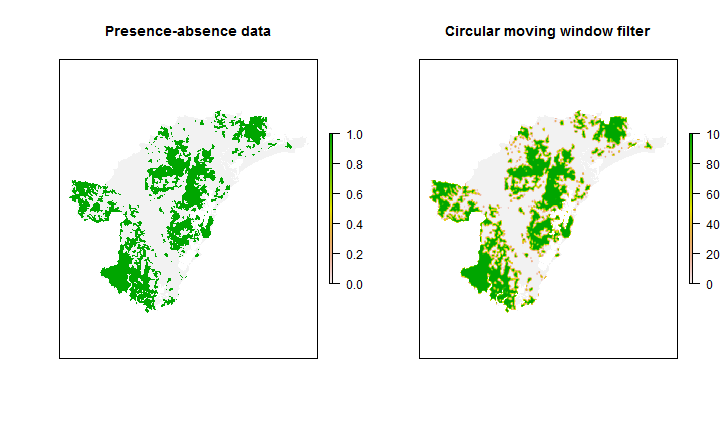

My attempt at Neighbourhood Analysis in R
========================================================

I want to calculate the percentage of cells that contain a particular type of habitat within a given radius based on the Greater Hunter Vegetation Map.  This is my attempt at doing that.

The plan is to:  
1. create presence/absence rasters for each of the vegetation groups we are interested in  
2. calculate the sum of cells within a given radius  
3. recalculate this as a percentage  

The original data will need to be exported from the geodatabase as shapefiles and/or rasters before analysis.  

The following functions set up the circular filter window `make_circ_filter`, turn a raster in to presence-absence based on a threshold `presence.absence` and calculate the percentage cover within a given window `percent.cover`.  `make_circ_filter` uses code from [Michael Scroggie](http://scrogster.wordpress.com/2012/10/05/applying-a-circular-moving-window-filter-to-raster-data-in-r/) and requires a cell resolution and radius that is a multiple of the resolution. 


```r
rm(list = ls())

packages(raster)
packages(rgdal)

# function to make a circular weights matrix of given radius and
# resolution NB radius must be an even multiple of res!
make_circ_filter <- function(radius, res) {
    require(raster)
    circ_filter <- matrix(NA, nrow = 1 + (2 * radius/res), ncol = 1 + (2 * radius/res))
    dimnames(circ_filter)[[1]] <- seq(-radius, radius, by = res)
    dimnames(circ_filter)[[2]] <- seq(-radius, radius, by = res)
    sweeper <- function(mat) {
        for (row in 1:nrow(mat)) {
            for (col in 1:ncol(mat)) {
                dist <- sqrt((as.numeric(dimnames(mat)[[1]])[row])^2 + (as.numeric(dimnames(mat)[[1]])[col])^2)
                if (dist <= radius) {
                  mat[row, col] <- 1
                }
            }
        }
        return(mat)
    }
    out <- sweeper(circ_filter)
    return(out)
}

# function to sum the values in the circular filter and divides by the
# number of cells (removing all cells with NA values)
percent.cover <- function(x) {
    sum(x, na.rm = T)/sum(cf, na.rm = T) * 100
}

# function to convert a raster to presence-absence data based on a
# threshold set threshold to zero to create a mask of the area
presence.absence <- function(x) {
    x[x < threshold] <- 0
    x[x >= threshold] <- 1
    return(x)
}
```


```r
setwd("C:/Users/awhitehead/Documents/GIS data/Hunter/data from Brendan/data/variables/projected GDA94/")

# open the selected sample file
sample.raster <- readGDAL("clipped/dry500cl.asc")
```

```
## clipped/dry500cl.asc has GDAL driver AAIGrid 
## and has 1104 rows and 1512 columns
```

```r
sample.raster <- raster(sample.raster)

# get the resolution of the raster
resolution <- xres(sample.raster)
radius <- resolution * 5

# set the circular filter
cf <- make_circ_filter(radius, resolution)

# create a sampling mask
threshold <- 0
mask <- calc(sample.raster, presence.absence)

# create a new presence-absence raster
threshold <- 50
r <- calc(sample.raster, presence.absence)

# calculate the percentage cover within the circular filter
r_filt <- focal(r, w = cf, fun = percent.cover) * mask

par(mfrow = c(1, 2))
plot(r, main = "Presence-absence data", axes = F)  #original data
plot(r_filt, main = "Circular moving window filter", axes = F)  #filtered data
```

 

```r

```


*This file was last updated on 30 January 2013 and last run on 30 January 2013.*
